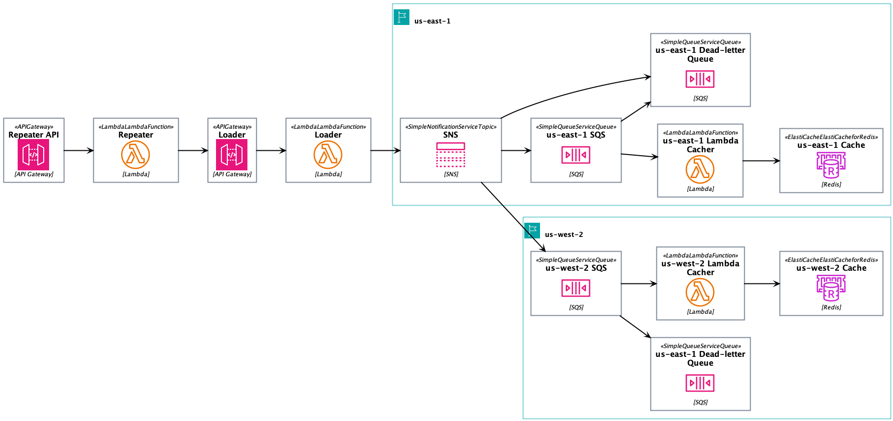

# Active-Active Cache

This solution implements an active-active cache across 2 AWS regions, using ElastiCache for Redis.This solution is automated with CDK and SAM. I described even the architecture below as code! It uses SNS and SQS to increase resilience.

## Architecture

